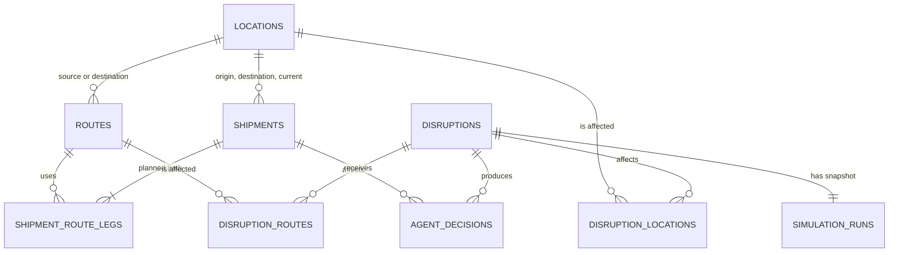

# Database

## Current Persistence

The MVP uses SQLAlchemy with SQLite by default:

```text
sqlite:///./reroute_agent.db
```

The database URL is configured through `DATABASE_URL`. Tests use the in-memory
`sqlite://` configuration with `StaticPool`. SQLite foreign-key enforcement is
enabled for every connection.

At startup, the application creates the structured schema and idempotently loads
the reproducible Asia dataset from `backend/app/asia_dataset.py` into SQLite.
That dataset uses existing canonical WPI port-master IDs and adds controlled
synthetic enterprise entities, derived routes, shipments, and ordered legs.
`load_runtime_dataset()` loads only the active Asia rows into the canonical
runtime models under `backend/app/domain/models.py`; API serializers convert
them back to the existing HTTP shape. NetworkX receives only that repository
snapshot. The small `backend/app/data.py` fixture remains for compatibility
tests and old databases, not as a competing active runtime source.

## Canonical Runtime Model

The repository-facing model is source-neutral and does not branch on whether a
record originated from synthetic seed data, WPI, PortWatch, CSV, or Parquet.

| Entity | Canonical runtime fields | Progress/state rule |
|---|---|---|
| `Location` | `location_id`, `name`, `location_type`, `country`, `latitude`, `longitude`, `unlocode`, `status`, `source` | Supports `PORT`, `CHECKPOINT`, `FACTORY`, `WAREHOUSE`, and `CUSTOMER`; accepted external identity is retained as provenance |
| `Route` | `route_id`, source/destination IDs, `transport_mode`, `distance_km`, `base_duration_hours`, `base_cost`, `max_capacity`, `risk_score`, `status` | Scenario duration, availability, and load live on NetworkX edges |
| `Shipment` | `shipment_id`, origin/destination/current IDs, `priority`, `required_delivery_time`, `current_eta`, `load_units`, `cargo_type`, `status` | `route_legs` is the structured route; compatibility route lists are derived properties |
| `ShipmentRouteLeg` | shipment/sequence/route/source/destination IDs, `status`, planned departure/arrival | Status is `COMPLETED`, `CURRENT`, or `PLANNED`; remaining-route helpers exclude completed legs |
| `Disruption` | `disruption_id`, event/target type and ID, severity/status, start/end, source, description, `is_simulated` | Manual and external events share this target-oriented contract; current API association tables remain compatibility storage |

`RuntimeDataset` is the repository snapshot containing canonical locations,
routes, and shipments. Persistence retains legacy storage column names for API
compatibility, while the generated Asia rows carry explicit provenance and
route-leg progress/times. Missing fields on older compatibility rows continue
to use safe derivation until the later cleanup migration.

## Canonical File Boundary

The prepared `data/` layer defines a source-neutral contract for future public and
synthetic datasets. Raw files remain under `data/raw/`, are normalized and
validated by `backend/data_pipeline/`, and produce processed artifacts under
`data/processed/`. WPI and PortWatch own external facts and observations only;
their CSV/Parquet files are ingestion artifacts, not the runtime shipment or
route database.

For this local MVP, SQLite is the runtime source of truth for canonical WPI
ports, synthetic enterprise locations, derived routes, synthetic shipments,
ordered shipment route legs, disruptions,
simulation history, and agent decisions. NetworkX is rebuilt transiently per
request/scenario and is never the persistence layer. `NetworkStateEngine` and
its graph projection hold temporary scenario availability, effective duration,
cost, risk, capacity, load, and disruption IDs; those values are not written to
the base route/location records. A later migration should
load canonical operational locations/routes/shipments into the runtime store
and retire synthetic seed ownership after validation. PostgreSQL, Neo4j, and
Kafka are not active components of this repository.

## Relationship Overview



## Master Data

### `locations` (compatibility storage names)

Represents canonical factories, ports, warehouses, customers, and future
checkpoints. The current table's `id`/`type` names are storage compatibility
names for the domain fields `location_id`/`location_type`.

| Column | Type | Constraints and purpose |
|---|---|---|
| `id` | string | Primary key |
| `name` | string | Display name |
| `type` | string | `FACTORY`, `PORT`, `WAREHOUSE`, or `CUSTOMER` |
| `country` | string | Country name |
| `latitude` | float | Map latitude |
| `longitude` | float | Map longitude |
| `status` | string | `ACTIVE` or `DISRUPTED` |
| `capacity` | float | Illustrative location capacity |

### `routes` (compatibility storage names)

Represents a canonical directed transport connection. The current table's
`id`/`mode`/`normal_duration_hours` names map to `route_id`/`transport_mode`/
`base_duration_hours`; current scenario state is not written back by routing.

| Column | Type | Constraints and purpose |
|---|---|---|
| `id` | string | Primary key |
| `source_location_id` | string | Foreign key to `locations.id` |
| `destination_location_id` | string | Foreign key to `locations.id` |
| `mode` | string | `SEA`, `ROAD`, `AIR`, or `RAIL` |
| `normal_duration_hours` | float | Baseline travel time |
| `current_duration_hours` | float | Current travel time |
| `cost` | float | Illustrative route cost |
| `risk_score` | float | Risk between 0 and 1 |
| `capacity` | float | Maximum route load |
| `current_load` | float | Baseline occupied capacity |
| `status` | string | `ACTIVE` or `BLOCKED` |

### `shipments` (compatibility storage names)

Represents a real or simulated canonical shipment. The ordered route is
normalized into `shipment_route_legs`; the current table's legacy names map to
the canonical fields.

| Column | Type | Constraints and purpose |
|---|---|---|
| `id` | string | Primary key |
| `origin_id` | string | Foreign key to `locations.id` |
| `destination_id` | string | Foreign key to `locations.id` |
| `current_location_id` | string | Foreign key to `locations.id` |
| `deadline` | datetime | Required delivery time |
| `priority` | string | `LOW`, `MEDIUM`, or `HIGH` |
| `load_units` | float | Capacity required by the shipment |
| `status` | string | `ON_TIME`, `AT_RISK`, `DELAYED`, or `REROUTED` |

### `shipment_route_legs` (compatibility storage names)

Preserves each shipment's planned path without storing a list inside one column.
The runtime stores and loads explicit `COMPLETED`, `CURRENT`, and `PLANNED`
progress values for the generated Asia population. Older rows without those
columns are handled by compatibility derivation during the additive SQLite
upgrade.

| Column | Type | Constraints and purpose |
|---|---|---|
| `shipment_id` | string | Composite primary key; foreign key to `shipments.id` |
| `sequence` | integer | Composite primary key; zero-based leg order |
| `route_id` | string | Foreign key to `routes.id` |
| `source_location_id` | string | Foreign key to `locations.id` |
| `destination_location_id` | string | Foreign key to `locations.id` |

## Simulation Data

### `disruptions`

Stores the event itself. Multiple affected locations and routes are kept in
association tables.

| Column | Type | Constraints and purpose |
|---|---|---|
| `id` | string | Primary key; generated UUID |
| `disruption_type` | string | Closure, shutdown, blockage, congestion, or multi-port |
| `start_time` | datetime | Simulation start |
| `estimated_end_time` | datetime | Start plus duration |
| `duration_hours` | integer | Requested duration |
| `severity` | string | Current severity label |
| `description` | text, nullable | Operator-supplied detail |
| `created_at` | datetime | Audit timestamp |

### `disruption_locations`

| Column | Type | Constraints and purpose |
|---|---|---|
| `disruption_id` | string | Composite primary key; foreign key to `disruptions.id` |
| `location_id` | string | Composite primary key; foreign key to `locations.id` |

### `disruption_routes`

| Column | Type | Constraints and purpose |
|---|---|---|
| `disruption_id` | string | Composite primary key; foreign key to `disruptions.id` |
| `route_id` | string | Composite primary key; foreign key to `routes.id` |

### `simulation_runs`

Preserves the existing API's simulation and reroute response snapshots. These JSON
snapshots are derived output, not the source of graph truth.

| Column | Type | Constraints and purpose |
|---|---|---|
| `disruption_id` | string | Primary key and foreign key to `disruptions.id` |
| `simulation_result` | JSON text | Initial affected-shipment and impact response |
| `reroute_result` | JSON text, nullable | Latest reroute response |
| `metrics` | JSON text, nullable | Latest aggregate metric object |
| `updated_at` | datetime | Last calculation timestamp |

### `agent_decisions`

Stores one deterministic recommendation per disruption and affected shipment.

| Column | Type | Constraints and purpose |
|---|---|---|
| `id` | integer | Primary key |
| `disruption_id` | string | Foreign key to `disruptions.id` |
| `shipment_id` | string | Foreign key to `shipments.id` |
| `status` | string | `REROUTED` or `NO_FEASIBLE_ROUTE` |
| `original_route` | JSON text, nullable | Original route comparison snapshot |
| `alternative_route` | JSON text, nullable | Selected route comparison snapshot |
| `estimated_delay_saved` | float | Backend-calculated hours saved |
| `additional_cost` | float | Backend-calculated cost difference |
| `risk_score` | float, nullable | Selected route risk |
| `route_score` | float, nullable | Deterministic ranking score |
| `reason` | text | Backend-generated selection reason |
| `confidence_score` | float, nullable | Reserved; null until a grounded definition exists |
| `llm_explanation` | JSON text, nullable | On-demand explanation, never route-selection truth |
| `decision_payload` | JSON text | Full API-compatible recommendation snapshot |
| `created_at` | datetime | Decision timestamp |

The pair `(disruption_id, shipment_id)` is unique. Re-running a disruption replaces
its prior agent-decision rows so history does not contain duplicate decisions for
the same shipment.

## Runtime Behavior

- `/locations`, `/routes`, and `/shipments` read persisted master data.
- `/simulate-disruption` inserts a disruption, its affected associations, and a
  simulation snapshot.
- `/reroute` inserts one agent decision for each affected shipment and updates the
  run snapshot and metrics.
- `/shipment-analytics` attaches an LLM explanation to the existing decision; it
  does not change the selected route.
- NetworkX still performs deterministic calculations in memory. Capacity
  reservations apply within a reroute batch and do not modify master route loads.
- Disruption policy values are scenario assumptions applied after canonical
  disruption normalization. External PortWatch facts do not directly write
  route penalties or availability into SQLite.

## Compatibility and Migration

Databases created before `ISS-0007` may contain a `runs` table with JSON blobs.
Startup creates the new tables beside it and seeds master data. New writes use only
the structured schema. Repository reads continue to include legacy rows that do
not conflict with a structured disruption ID. If a legacy disruption is rerouted,
that record is copied into the structured tables transactionally before new agent
decisions are written.

The original legacy row is not deleted or rewritten. A future bulk production
migration must:

1. back up the database;
2. validate every legacy JSON record;
3. migrate disruptions and decisions transactionally;
4. compare record counts and calculated metrics; and
5. remove `runs` only after explicit approval.

This local MVP uses `create_all` for additive table creation. It does not yet use
Alembic or provide production rollback automation.

## External signal exposure boundary

Phase 4.1 does not persist provider payloads or external signals. The
provider-independent ExternalSignal and OperationalEffect contracts are
validated in memory. Route corridor memberships and representative maritime
sample points are persisted as structured JSON metadata on the existing routes
table, with additive nullable columns for compatibility with existing SQLite
databases:

- corridor_ids_json: curated corridor/chokepoint memberships;
- weather_sample_points_json: representative maritime exposure points, not
  vessel-navigation tracks.

OperationalEffect is a future policy contract and is not applied to route or
node state in this phase.

## Graph Storage Boundary

The current graph engine remains NetworkX. Neo4j environment variables are
placeholders, and no Neo4j repository is active. The relational schema stores the
same node and edge master data so a later Neo4j adapter can seed its graph without
changing API contracts.

## Change Rules

Before changing persistence:

1. Read this document and `docs/SECURITY.md`.
2. Create or select a local issue.
3. Define backward compatibility and migration behavior.
4. Make the smallest schema change.
5. Add a migration strategy before changing an existing deployed schema.
6. Update API contracts and tests when stored shapes affect responses.
7. Verify with an isolated local database; never use production data.

Generated `reroute_agent.db` files must remain untracked.
